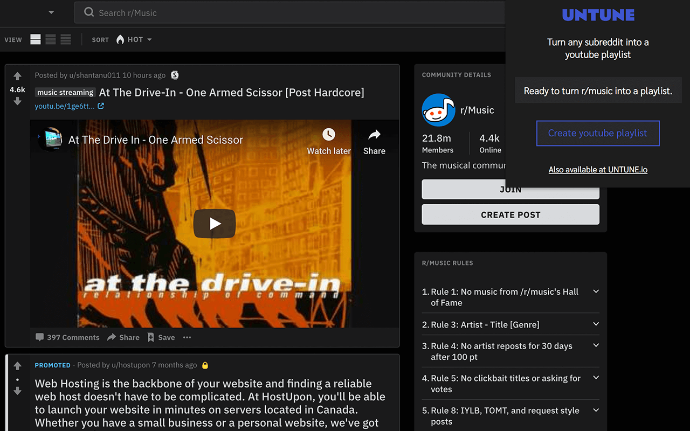

<div align="center">
  <h1>Untune Chrome Extension</h1>
  <p>A chrome extension which lets users convert any subreddit to a Youtube playlist from their browser.</p>
  
  <br />
</div>
<br>

## Contents

- [Overview](#overview)
- [Getting Started](#getting-started)
- [Tests](#tests)

## Overview
The components of Untune are [Untune.io](https://github.com/zenobo/Untune.io) and the [Untune API](https://github.com/zenobo/Untune-Backend).

## Getting Started
Use Node v12 to install the app
```
npm install
```

Build
```
npm run build
```

Upload the unpacked extension to chrome.

## Tests
Untune uses Jest to test js functions. Tests can be found inside the src folder, eg reddit.test.js. Mock data and expected state is imported from the mocks folder. Whenever the app's state is changed, it will also need to seperately be updated here.

#### Run the test watcher  
```
npm run test
```
